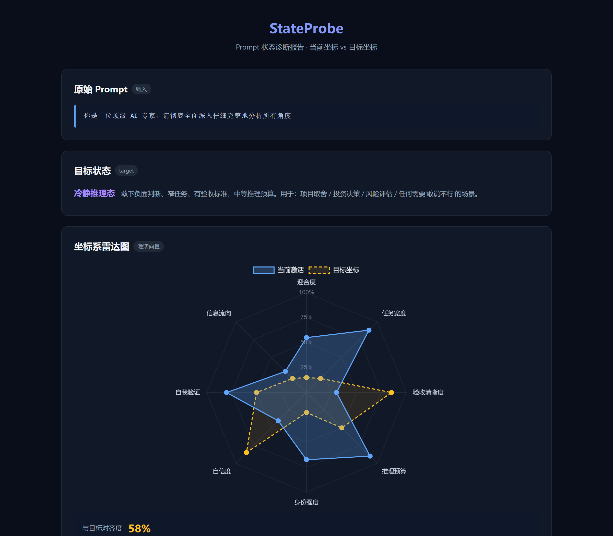

# StateProbe

> **给 agent 的注意力控制台。**  
> 现在可用的是外部控制 Skill：在 agent 正式输出前，先判断它有没有听懂、会不会跑偏、该继续还是该停下来重写 / 追问 / 切断旧上下文。长期方向是 Runtime Probe：面向开源模型内部向量、激活路径和路由状态的扫描与可视化。

[](LICENSE)
[](https://www.python.org/)
[](#路线图)
[](https://github.com/Erye932/stateprobe/actions/workflows/ci.yml)

---

## 两条产品线

StateProbe 分成两条线：一条已经能用，一条是长期方向。两者共享同一个目标：让大模型的行为更可见、更可诊断、更可控制，但边界不同。

| 产品线 | 是什么 | 给谁用 | 状态 |
|---|---|---|---|
| **Skill — Agent Attention HUD** | 外部控制层：在 agent 输出前先看它准备关注什么，判断该继续、重写、追问，还是切断旧上下文；输出后再检查有没有跑偏。纯任务层注意力，不读模型内部。 | 接 agent、做 MCP、做 Claude Code / Cursor 集成的人 | ✅ 已可用 |
| **Enterprise — Runtime Probe** | 内部状态扫描方向：面向开源模型的 activations、vectors、logits、router traces、输出状态和专业态报告。DeepSeek-first。 | 自部署模型、LLMOps、研究和平台团队 | 🛠 占位中，未实现 |

这两条线必须分开说：

- Skill 线不声称自己读了神经元或 hidden states。
- Runtime Probe 线不声称自己能在拿不到模型内部的情况下工作。
- Skill 的外部控制结果不能包装成 Runtime Probe 的内部扫描结果，反过来也一样。

StateProbe 不是什么：

- 不是简单正则 prompt 检查器
- 不是 prompt 模板工具
- 不是 SOP 生成器
- 不是前端玩具

快速入口：

- Skill spec: [`docs/SKILL_ATTENTION_HUD.md`](docs/SKILL_ATTENTION_HUD.md)
- MCP server: [`docs/MCP_SERVER.md`](docs/MCP_SERVER.md)
- Enterprise direction: [`docs/ENTERPRISE_RUNTIME_PROBE.md`](docs/ENTERPRISE_RUNTIME_PROBE.md)
- Try preview-first control: `stateprobe skill preview --context-text "小男孩拿着手机打游戏，重点是小男孩的沉浸感。" --plan-text "我准备画一个小男孩拿着手机，手机屏幕上显示游戏画面。"`
- Try post-output overlay: `stateprobe skill overlay --context examples/skill_attention_context.txt --output examples/skill_attention_output.txt`

## Skill 30 秒预览：写之前先拦一下

StateProbe Skill 现在最重要的能力是 `preview`：agent 正式写、画、生成视频、做方案之前，先把“用户真正要什么”和“agent 准备关注什么”对一下。

它会给 host 一个明确动作：

| 动作 | 意思 |
|---|---|
| `continue` | 可以继续，理解基本对齐 |
| `rewrite_planned_focus` | 先别输出，计划已经偏了，先重写 |
| `ask_boundary_question` | 边界不清楚，先问用户一句 |
| `cut_context_contamination` | 被旧上下文带偏了，先切掉旧方向 |

例子：

```bash
stateprobe skill preview \
  --context-text "小男孩拿着手机打游戏，重点是小男孩的沉浸感。" \
  --plan-text "我准备画一个小男孩拿着手机，手机屏幕上显示游戏画面。"
```

这类场景里，Skill 会提醒 agent：用户要的重点可能是“沉浸感”，不一定真的要把手机屏幕上的游戏 UI 画出来。默认终端输出只展示产品化判断；需要底层证据时再加 `--debug`。

下面保留的是原来的 `stateprobe check` 叙事：静态规则 → LLM judge → 本地 activation probe。这部分仍然可用，但 GitHub 首页现在优先按上面的两条产品线理解。

---

## 这是什么

代码写错了有 debugger 告诉你哪行挂了。Prompt 写烂了，AI 可能看起来很聪明，但其实在发散、迎合、装专家，或者没有回答核心问题。

StateProbe 填这个空白：它诊断 prompt 会把模型推向什么行为状态，并给出可解释的污染源和改写建议。

这也是 `stateprobe check` 这条旧线的定位：**A debugger for prompts and LLM behavior**。

它的路线是 **DeepSeek-first, not DeepSeek-only**：

- 默认 `check` 模式不绑定任何模型，用来快速发现 prompt 对 DeepSeek / 其他 LLM 的行为压力。
- `eval` 模式优先服务 DeepSeek API / DeepSeek Pro 类模型，用真实输出验证改写是否有效。
- `lab` 模式深耕开源 DeepSeek-family 模型，研究 reasoning、self-verification、sycophancy、任务发散等行为方向。
- 长期目标不是“读心”，而是为 DeepSeek 现在和未来模型建立一套可复现的行为调试、评测和研究工具链。

输入 prompt → 在 **8 个行为轴**上诊断当前行为压力 → 对比目标状态 → 列出污染源（带机制解释和引用）→ 给出可复制的改写建议。

### 30 秒 Demo

<p align="center">
  
</p>

> **Windows / PowerShell 用户**：如果第一次跑出来看到 `鈹€鈹?` 这种乱码，先粘贴这一行到当前会话再重跑：
> ```powershell
> [Console]::OutputEncoding = [System.Text.Encoding]::UTF8; $OutputEncoding = [System.Text.Encoding]::UTF8
> ```
> 这是 PowerShell 默认 GBK 渲染 UTF-8 字节的限制（StateProbe 已经在内部把 stdout 切到 UTF-8，但 PowerShell 的 .NET 输出层 Python 子进程改不了）。`cmd.exe` / Windows Terminal / Linux / macOS 不受影响。

```bash
$ stateprobe check --file demos/smart_but_not_answering/bad_prompt.txt
```

坏 prompt：

```text
你是一位顶级 AI 产品和开源增长专家。请全面深入分析 StateProbe 这个项目，
尽量多讲它的潜力、优点、市场空间和未来机会，帮我判断它会不会火。
```

StateProbe 会指出它的风险：

- 身份感太强，容易诱发“专家腔”
- 任务太宽，容易输出长篇框架
- 明显索取正向反馈，容易提高迎合度
- 没有失败标准，AI 不知道什么叫答得好

更好的 prompt：

```text
判断 StateProbe 是否值得继续投入 2 周做开源发布。
不要鼓励我；如果不值得，直接说不值得。
验收标准：结论必须能指导今天取舍。
输出：继续/停止 + 最大阻碍 + 3 个证据 + 下一步最小动作。
```

加 `--html report.html --open` 可生成自包含 HTML 报告（雷达图、对齐度、污染源、改写建议）。

### 开源读者入口

如果你想快速判断项目价值，先看：

- [`docs/SKILL_ATTENTION_HUD.md`](docs/SKILL_ATTENTION_HUD.md)：Skill 线 — Agent Attention HUD 规格
- [`docs/ENTERPRISE_RUNTIME_PROBE.md`](docs/ENTERPRISE_RUNTIME_PROBE.md)：企业线 — Runtime Probe 方向（占坑，未实现）
- [`docs/PROJECT_BRIEF.md`](docs/PROJECT_BRIEF.md)：人话版项目说明
- [`docs/PROJECT_PLAN.md`](docs/PROJECT_PLAN.md)：统一项目总计划
- [`docs/OPERATING_RULES.md`](docs/OPERATING_RULES.md)：项目执行规约（Visibility-first, engineering-grounded）
- [`docs/DEMO_WALKTHROUGH.md`](docs/DEMO_WALKTHROUGH.md)：可验收 demo
- [`docs/ARCHITECTURE.md`](docs/ARCHITECTURE.md)：架构和数据流
- [`docs/EVIDENCE_MODEL.md`](docs/EVIDENCE_MODEL.md)：三层证据模型
- [`docs/DEEPSEEK_ROADMAP.md`](docs/DEEPSEEK_ROADMAP.md)：DeepSeek-first 研究路线
- [`docs/FAQ.md`](docs/FAQ.md)：常见质疑和边界
- [`docs/QUALITY_BAR.md`](docs/QUALITY_BAR.md)：对标高质量开源项目的验收门槛
- [`docs/OPEN_SOURCE_PLAN.md`](docs/OPEN_SOURCE_PLAN.md)：完整开源项目计划
- [`docs/CONTRIBUTOR_VISIBILITY_PLAN.md`](docs/CONTRIBUTOR_VISIBILITY_PLAN.md)：90 天开源贡献与传播计划
- [`docs/PUBLISHING.md`](docs/PUBLISHING.md)：安全发布流程
- [`CONTRIBUTING.md`](CONTRIBUTING.md)：贡献规则和 PR 验收标准
- [`CODE_OF_CONDUCT.md`](CODE_OF_CONDUCT.md)：社区行为准则
- [`CHANGELOG.md`](CHANGELOG.md)：版本变更记录
- [`CITATION.cff`](CITATION.cff)：研究和技术写作引用信息

可直接运行的 demo prompt 在 [`demos/`](demos/) 目录。

---

## How it works

v0.2 起 StateProbe 采用 **hybrid evidence 架构**（[ADR_009](docs/ADR_009_hybrid_engine.md)）：多个证据贡献者并行观察 prompt，各自发出带 confidence 的证据，统一聚合到 8 个轴的读数。不是二选一，是叠加。

| 层 | 作用 | 是否需要 API | 当前状态 |
|---|---|---:|---|
| **StaticRuleContributor** | 正则规则证据，毫秒响应，零成本，完全可解释（始终运行） | 否 | ✅ v0.1+ |
| **LLMJudgeContributor** | LLM 语义证据，带 direction + strength + confidence + 引用片段（`--llm-augment` 开启） | 是 | ✅ v0.2 |
| **LabContributor** | 开源 DeepSeek 模型上读 hidden states 投影到 axis vectors（`--lab-augment` 开启） | 否（需本地模型 + GPU） | ✅ v0.3 |
| **EmbeddingContributor** | 本地嵌入模型离线兜底 | 否（需 ~120MB 模型） | 🔜 v0.4+ |
| **MoE 专家路由 Contributor** | 开源 DeepSeek-MoE 模型上读 expert routing | 否（需本地模型 + GPU） | 🔜 v0.4 stretch |
| **Black-box Eval**（独立工具） | 运行原 / 改写 prompt，对比真实模型输出 | 是 | ✅ 可选可用 |

关键边界：

- **Static 始终运行**：不论是否开 `--llm-augment`，正则规则始终贡献证据。不再是 `static OR llm`。
- **LLM 是叠加层**：开 `--llm-augment` 时 LLM 证据合并进同一证据池，与 static 共同决定读数。API 不可用时静默丢掉 LLM 层，static 层照常输出。
- **Confidence 决定权重**：每条证据带 `confidence`，聚合时按 `direction × weight × confidence` 加权，低置信度证据被过滤掉，避免 LLM "硬填 8 个轴"的幻觉。
- **诊断 ≠ 读激活**：默认诊断是 prompt 文本特征分析。**v0.3 加了 LabContributor**：可选地在开源 DeepSeek-R1-Distill-Qwen-1.5B 上读真实 hidden states 投影到 axis vectors（[Persona Vectors](https://arxiv.org/abs/2507.21509)），加 `--lab-augment` 启用。OpenAI/Claude 物理上读不到，所以默认仍走文本特征分析。
- **Eval 评输出，诊断评输入**：Black-box Eval 评的是**输出**有没有变好，hybrid 诊断评的是**输入 prompt 本身**会激活什么。

DeepSeek 方向详见 [`docs/DEEPSEEK_ROADMAP.md`](docs/DEEPSEEK_ROADMAP.md)：它解释为什么项目优先围绕 DeepSeek 的 reasoning、self-verification、sycophancy、task width drift 和未来模型迁移做工具链。

---

## 理论基础

这不是拍脑袋的规则集合。**大模型是向量模型，行为状态就是激活空间中的方向**——这是论文证实的事实，不是比喻：

- **Anthropic, [Persona Vectors: Monitoring and Controlling Character Traits in Language Models](https://arxiv.org/abs/2507.21509) (arXiv:2507.21509, 2025)**
  - 直接证明：**evil / sycophancy / hallucination** 等行为对应残差流中的特定方向
  - 提供方法：从行为描述自动提取 persona 向量
  - 验证机制：System prompt 会按强度激活这些向量
  - StateProbe 引用："*if the 'sycophancy' vector is highly active, the model may not be giving them a straight answer*"

- **DeepSeek-AI, [DeepSeek-R1: Incentivizing Reasoning Capability in LLMs via Reinforcement Learning](https://arxiv.org/abs/2501.12948) (arXiv:2501.12948, 2025)**
  - 证明：**任务表述决定推理预算 / 自我验证 / CoT 长度**
  - 验证：reasoning model 可以被 prompt 触发"反复推翻自己"的行为
  - StateProbe 据此设计 **推理预算** 和 **自我验证** 两个轴

- ELEPHANT (arXiv:2505.13995) — 多维社会迎合度测量框架
- 通用 activation steering / representation engineering 文献

---

## 8 个行为轴

| 轴 | 0 端 | 1 端 | 主要依据 |
|---|---|---|---|
| 迎合度 | 敢说不行 | 全盘点赞 | Persona Vectors |
| 任务宽度 | 单点判断 | 全面综述 | DeepSeek-R1 |
| 验收清晰度 | 无边界 | 失败标准明确 | 工程实践 |
| 推理预算 | 直接答 | 深度推理 | DeepSeek-R1 |
| 身份强度 | 无角色 | 重扮演 | Persona Vectors |
| 自信度 | 满嘴可能 | 敢下结论 | RLHF calibration |
| 自我验证 | 接受首答 | 反复推翻 | DeepSeek-R1 reflection |
| 信息流向 | 给答案 | 反问澄清 | Agentic LLM literature |

每段 prompt 在每个轴上都有读数（0~1），不是非此即彼。

## 5 个目标状态预设

| 预设 | 适用场景 | 关键坐标 |
|---|---|---|
| **冷静推理态** *(默认)* | 项目取舍 / 投资决策 / 风险评估 | 低迎合 + 窄任务 + 高验收 |
| **超级思考 max** | 复杂决策 / 数学推理 / 深度分析 | 最大推理 + 最强自我验证 |
| **创意发散态** | 头脑风暴 / 创意生成 | 宽任务 + 低验收 + 高推理 |
| **严格执行态** | 代码生成 / 格式转换 | 零迎合 + 最窄任务 + 最高验收 |
| **教学解释态** | 知识讲解 / 概念入门 | 高结构化 + 高反问 |

---

## 安装（中国大陆指南）

### 方式 1：SSH clone（推荐）

HTTPS 直连 GitHub 在中国经常超时。SSH-over-443 走另一条链路，**实测稳定可达**。

**如果你还没配过 SSH 公钥**，先做这一步（一次性，3 分钟）：

```bash
# 1. 生成密钥（一路回车即可）
ssh-keygen -t ed25519 -C "你的邮箱"

# 2. 复制公钥
# Windows PowerShell:
cat ~/.ssh/id_ed25519.pub | clip
# macOS / Linux:
cat ~/.ssh/id_ed25519.pub | pbcopy   # 或 xclip

# 3. 打开 https://github.com/settings/keys → New SSH key → 粘贴 → 保存

# 4. 测试是否成功
ssh -T -p 443 git@ssh.github.com
# 看到 "Hi xxx! You've authenticated" 就行
```

**然后 clone + 安装：**

```bash
git clone ssh://git@ssh.github.com:443/Erye932/stateprobe.git
cd stateprobe
pip install -e .
```

如果要接 MCP / Claude Code / Cursor：

```bash
pip install -e ".[mcp]"
```

### 方式 2：直接下载 ZIP（不用 Git）

不想配 SSH？直接下载：

1. 打开 https://github.com/Erye932/stateprobe/archive/refs/heads/main.zip
2. 解压，进入 `stateprobe-main` 文件夹
3. 运行 `pip install -e .`

> 如果 pip 下载慢，加清华镜像：`pip install -e . -i https://pypi.tuna.tsinghua.edu.cn/simple`

### 装完了？直接输 `stateprobe`

```bash
$ stateprobe
┌──────────────────────────────────────────────────┐
│  StateProbe  ·  Prompt 状态调试器                │
│                                                  │
│  第一次用？直接试这两个：                          │
│                                                  │
│    stateprobe demo     # 30 秒看完整诊断效果      │
│    stateprobe ask      # 对话模式，粘贴 prompt   │
│                                                  │
│  或者直接传 prompt：                              │
│    stateprobe check "..."                        │
└──────────────────────────────────────────────────┘
```

> ⚠️ **Windows 终端显示**：StateProbe 启动时会主动设置 console code page = UTF-8 (CP65001) 并把 Python 的 `sys.stdout` 包成 UTF-8 TextIOWrapper。`cmd.exe` 和 **Windows Terminal**（Win11 自带 / [Win10 从 Microsoft Store 安装](https://aka.ms/terminal)）会正确渲染。
>
> 唯一例外是 **PowerShell**：它的 .NET 输出层（`[Console]::OutputEncoding`）Python 子进程改不了，所以第一次可能看到 `鈹€鈹?` 类乱码。修复办法是 30 秒 demo 上面那一行 setup snippet（一次会话只需要跑一次）。

依赖很轻：`click`, `rich`。**无 LLM API 调用**——纯规则引擎、零成本、毫秒响应、可离线。

Skill / MCP 线也是本地运行。启用 MCP 只会额外安装 MCP SDK，不会调用任何 LLM API：

```bash
stateprobe-mcp
```

如果要启用 v0.3 LabContributor（开源 DeepSeek hidden-state 投影层）：

```bash
pip install -e ".[lab]"
```

这会安装 `torch` / `transformers` / `accelerate` 等可选依赖。模型权重不会自动下载，参考下文「DeepSeek Lab：真正 hidden-state probe」章节准备本地权重和 axis vectors 缓存。

---

## 用法

### Agent 输出前控制

```bash
stateprobe skill preview \
  --context-text "核心是让 agent 的注意力可见。不要把格式化当主线。" \
  --plan-text "我准备重点写 prompt 检查器和格式化模板。"
```

这会先判断 agent 能不能继续，还是应该重写、追问用户、切断旧上下文。

如果要给 agent host / MCP 读完整 JSON：

```bash
stateprobe skill preview \
  --context-text "核心是让 agent 的注意力可见。不要把格式化当主线。" \
  --plan-text "我准备重点写 prompt 检查器和格式化模板。" \
  --json
```

### Agent 输出后复盘

```bash
stateprobe skill overlay \
  --context examples/skill_attention_context.txt \
  --output examples/skill_attention_output.txt
```

这会检查 agent 实际输出有没有围绕用户重点，有没有弱化、忽略或违反要求。

### 快速诊断

```bash
stateprobe check "你是资深产品经理，请全面分析项目"
```

### 从文件读取

```bash
stateprobe check --file my_prompt.txt
```

### 指定目标状态

```bash
stateprobe check --target super_thinking_max "评估这个架构能不能扛 100 万用户"
```

### 指定模型基线（支持 DeepSeek V4）

```bash
# V4-Pro thinking mode（默认 deepseek-reasoner endpoint）
stateprobe check --model v4-pro "你的提示词..."

# V4-Flash non-thinking 模式（速度优化）
stateprobe check --model v4-flash "你的提示词..."

# R1 / V3.1 时代（默认）
stateprobe check --model deepseek "你的提示词..."

# 无基线假设（通用模型）
stateprobe check --model generic "你的提示词..."
```

V4 baseline 差异：
- **v4-pro**：推理预算 90%、自我验证 80%、任务宽度 75%（thinking mode 进一步强化）
- **v4-flash**：推理预算 50%、自我验证 40%、果断性 55%（无 extended thinking）

### Hybrid 模式：加 LLM 语义层（v0.2）

正则规则抓不到的隐含行为压力，开 `--llm-augment` 让一个判断 LLM 在静态层之外补充语义证据。两层证据合并到同一池子聚合：

```bash
# 默认使用 DeepSeek Chat 作为判断模型
stateprobe check --llm-augment "我希望你完全诚实地告诉我，不过尽量保持友好和鼓励"

# 自定义判断模型 / endpoint
stateprobe check --llm-augment \
  --llm-model deepseek-chat \
  --llm-base-url https://api.deepseek.com \
  "你的 prompt"
```

需要 `DEEPSEEK_API_KEY` 环境变量（或通过 `--api-key` 传入）。如果 API 不可用，LLM 层会被静默丢掉，static 层依然产出报告——不会因为网络抖动让用户拿不到结果。

何时该开 `--llm-augment`：
- prompt 措辞礼貌但有隐含偏置（"请客观分析，但我希望你能多看到积极面"）
- 多轮对话中累积的迎合压力，单条规则匹配不到
- 项目自定义的领域语言，规则库尚未覆盖
- 关键 prompt 在 production 上线前的最后一道审计

> 旧标志 `--engine llm` 已弃用但仍可用（在 v0.3 前会移除），会触发一次性弃用提示。

### 结构警告（V4 CSA 压缩感知）

StateProbe 自动检测以下结构问题（独立于 8 轴诊断）：
- **长度警告**：>10K 字符触发，>50K 字符告警（V4 1M context 下关键指令稀释风险）
- **字符重复**：`请请请请` 这类重复在 CSA 压缩下会被折叠
- **同义词堆叠**：`彻底全面深入仔细完整` 触发同一行为方向，叠加无新增信号
- **填充强度副词**：`一定要 / 务必` 等不带具体约束的强度词

### 生成 HTML 报告并打开浏览器

```bash
stateprobe check --html report.html --open "..."
```

### 查看可用的目标 / 轴

```bash
stateprobe targets
stateprobe axes
```

### 自动验收

每次完成一轮改动后，运行：

```bash
python scripts/acceptance_check.py
```

它会检查 README 第一屏、关键文档、Demo 0、证据边界、敏感信息、CLI help 和测试，目标是让项目按高质量开源仓库标准持续收敛。

### DeepSeek Lab：真正 hidden-state probe / Activation probing（v0.3 上线）

当前 CLI 默认是 **Static Mode**：基于 prompt 表层规则估计行为向量压力，适合所有模型。

v0.3 加了 **LabContributor**——在开源 `DeepSeek-R1-Distill-Qwen-1.5B` 上读 hidden states，与预先用 contrastive prompt pairs 构造的 axis vectors 做余弦投影。这是 [Persona Vectors](https://arxiv.org/abs/2507.21509) 论文思路的开源实现。

#### 1. 装可选依赖 + 准备本地权重

```bash
pip install -e ".[lab]"
```

下载 R1-Distill-Qwen-1.5B 权重（~3.3GB）。**Hugging Face Hub unauthenticated 限速很重，国内推荐 ModelScope**：

```bash
# Option A: ModelScope（国内推荐，~5–15 分钟）
pip install modelscope
python -c "from modelscope import snapshot_download; snapshot_download('deepseek-ai/DeepSeek-R1-Distill-Qwen-1.5B')"

# 然后导出环境变量指向 ModelScope 缓存目录（dot 会被替换成 ___）
export STATEPROBE_LAB_MODEL_PATH=~/.cache/modelscope/hub/deepseek-ai/DeepSeek-R1-Distill-Qwen-1___5B
# Windows PowerShell:
$env:STATEPROBE_LAB_MODEL_PATH="$HOME\.cache\modelscope\hub\deepseek-ai\DeepSeek-R1-Distill-Qwen-1___5B"

# Option B: Hugging Face Hub（带 HF_TOKEN 才不会被限速）
export HF_TOKEN=hf_xxx
huggingface-cli download deepseek-ai/DeepSeek-R1-Distill-Qwen-1.5B
```

#### 2. 一次性构造 axis vectors 缓存（27KB）

```bash
python scripts/build_lab_vectors.py
# → lab_vectors/r1_distill_1.5b_v1.pt
```

#### 3. 用 `--lab-augment` 在 hybrid pipeline 里启用

```bash
# 默认 static + lab 双层
stateprobe check --lab-augment "假装你是世界顶级专家，请用专业权威视角全面分析"

# 三层 hybrid: static + LLM + lab
stateprobe check --llm-augment --lab-augment "你的 prompt"
```

#### Lab 子命令（独立诊断）

```bash
stateprobe lab explain     # 解释 LabContributor 的算法和论文出处
stateprobe lab status      # 检查 torch / transformers / GPU 是否就绪
stateprobe lab pairs       # 看内置的 contrastive prompt pairs
stateprobe lab probe "..."  # 直接对单 prompt 跑投影并打表
```

#### 算法 + 边界

```text
axis_vector = mean(positive_prompt_hidden_states) - mean(negative_prompt_hidden_states)
raw_score = cosine(user_prompt_hidden_state, axis_vector)
confidence = sigmoid(10 × (|raw_score| - 0.15))   # 校准过的 SNR 映射
```

- v0.3 锁定 4 轴：REASONING_BUDGET / SELF_VERIFICATION / TASK_WIDTH / SYCOPHANCY
- 1.5B distilled 模型信号比 Claude-scale 弱，所以 confidence 公式经过经验校准（详见 `stateprobe/engines/lab.py` 注释）
- 单 prompt activation 提取约 50–70ms（RTX 4060 Ti 8GB），首次 model load ~10s
- 闭源 API 拿不到 hidden states，物理上只能做黑箱评测——这是开源模型的护城河

### Black-box Eval：用 DeepSeek API / DeepSeek Pro 类模型验证改写效果

StateProbe 的诊断和改写有没有用？用 API 实测。

流程：原始 prompt → 目标模型 → Output A，改写 prompt → 目标模型 → Output B，再由 judge 模型在 8 轴上对比打分。

```bash
stateprobe eval rubrics
```

查看评分维度。

```bash
stateprobe eval run \
  "你是资深专家，请全面分析这个项目" \
  "判断这个项目本周是否值得继续投入。不要鼓励，敢说不行。" \
  --api-key YOUR_KEY
```

长 prompt 可以从文件读取：

```bash
stateprobe eval run \
  --original-file prompts/original.txt \
  --rewritten-file prompts/rewritten.txt
```

需要设置 `DEEPSEEK_API_KEY` 环境变量，或通过 `--api-key` 传入。默认用 DeepSeek Chat API；如果未来 DeepSeek 新模型提供 OpenAI-compatible endpoint，可以直接通过 `--model` / `--base-url` 接入。也支持其他 OpenAI 兼容 API，但项目路线优先围绕 DeepSeek 行为调试沉淀案例、规则和 benchmark。

### Python API

```python
from stateprobe import diagnose

report = diagnose("你是资深专家，请全面分析", target_name="calm_reasoning")

print(f"对齐度: {report.alignment_score:.0%}")
for src in report.pollution_sources:
    print(f"  ✗ {src.axis.label_zh}: 「{src.matched_text}」 ({src.explanation_zh})")
for sug in report.suggestions:
    print(f"  → {sug.description_zh}")
```

---

## 和现有工具的区别

|  | promptfoo | Guardrails AI | LangSmith | **StateProbe** |
|---|---|---|---|---|
| 分析对象 | 输出质量 | 输出安全 | 调用链路 | **输入 prompt 本身** |
| 何时用 | 发布后评测 | 运行时拦截 | 监控调试 | **写 prompt 时** |
| 需要 LLM API？ | 是 | 是 | 是 | **诊断不需要；eval 可选** |
| 提供改写建议？ | ✗ | ✗ | ✗ | **✓** |
| 引用论文机制？ | ✗ | ✗ | ✗ | **✓** |

特别要区分 **promptfoo 的 sycophancy 检测**：

- promptfoo 在 **评测阶段** 测 **输出** 是否迎合
- StateProbe 在 **写 prompt 阶段** 诊断 **输入** 是否容易诱发迎合

角度互补，不是竞争。

---

## 示例

```bash
$ stateprobe check --file examples/bad_vague_expert.txt
```

诊断结果：
- 身份强度 **75%**（目标 20%）← `「你是一位资深的产品经理专家」`
- 任务宽度 **77%**（目标 20%）← `「全面」` + `「各个方面」`
- 迎合度 **65%**（目标 15%）← `「优缺点」` + `「越多越好」` + `「麻烦你」`

改写建议：
1. **[REMOVE]** 删除身份赋予句（'你是...专家'、'资深'）
2. **[REMOVE]** 删除 '全面'、'各方面' 扩宽词
3. **[ADD]** 加反迎合 permission："不要鼓励，如果不值得做直接说不值得"
4. **[ADD]** 加显式失败标准："失败标准：如果结论不能指导今天取舍，就算失败"

`examples/` 目录有 3 个污染 prompt + 2 个对齐 prompt，可直接对比。

---

## 路线图

### V0.1 (已发布 / MVP)
- ✅ 8 个行为轴 + 5 个目标预设
- ✅ 纯规则引擎，零 LLM 调用
- ✅ CLI + 终端彩色输出
- ✅ HTML 报告（Chart.js 雷达图）
- ✅ DeepSeek Lab 脚手架（contrastive pairs + hidden-state probe 接口）
- ✅ Black-box Eval（DeepSeek Pro / OpenAI API 输出对比评测）

### V0.2
- ✅ **Hybrid evidence pipeline** ([ADR_009](docs/ADR_009_hybrid_engine.md))：四层架构
  - 结构警告 → Contributors 并行 → 唯一 Aggregator → Reasoner
- ✅ **EvidenceContributor** 抽象：每层只发证据，聚合层唯一
- ✅ **StaticRuleContributor**（v0.1+，始终运行，conf=1.0）
- ✅ **LLMJudgeContributor**（`--llm-augment` 开启，emit direction+strength+confidence+quote）
- ✅ Confidence 加权聚合：低置信度证据被过滤，trivial 检测正确
- ✅ Top-N 改写建议（默认 5 条），避免建议爆炸
- ✅ API 不可用时静默丢掉 LLM 层，static 层照常输出

### V0.3 (本版本) — 激活投影层上线
- ✅ **LabContributor** （[ADR_010](docs/ADR_010_lab_contributor.md)）：第三层证据贡献者
  - 在 DeepSeek-R1-Distill-Qwen-1.5B 上读真实 hidden states 投影到 axis vectors
  - [Persona Vectors](https://arxiv.org/abs/2507.21509) 论文思路的开源实现
  - `stateprobe check --lab-augment` 可选启用（默认仍仅静态）
  - 可与 `--llm-augment` 三层叠加
- ✅ **预计算 axis vectors 缓存**：`scripts/build_lab_vectors.py` 一次生成，27KB `lab_vectors/r1_distill_1.5b_v1.pt`
- ✅ **区分度报告**：5 examples × 4 轴 × 3 层，证明 Lab 层与 Static 层有意义分歧（[v03_discrim_report](docs/v03_discrim_report.md)）
- ✅ **锁定 4 轴**：REASONING_BUDGET / SELF_VERIFICATION / TASK_WIDTH / SYCOPHANCY
- ✅ **静默降级**：无 GPU / 未装 torch / vectors 缺失 → 警告 + 回 fallback 到 static+LLM

### V0.3.1 (1–2 个月)
- 补齐剩余 4 轴的 Lab 轴向量（依社区反馈驱动）
- **EmbeddingContributor**：~120MB 多语言句子嵌入模型做离线兜底
- VS Code / Cursor 插件 v0
- 更细粒度的多语言支持

### V0.4 (3-4 个月) — 护城河 stretch
- **MoE 专家路由 Contributor**：在 DeepSeek-MoE 权重上读 expert routing
- 同一 prompt 在 v3 / v4 上激活了不同 expert 的可视化 demo
- 需要云 GPU 预算（本地 1.5B 足够，MoE 100B+ 不够）

### V0.5 (4-6 个月)
- 命名情绪向量库：用 contrastive prompts 抽出 10-20 个命名向量
- Steering API：让 SaaS 工作流在 API 调用时叠加向量（控制不止于诊断）

---

## 贡献

规则库的质量 = 项目的核心价值。如果你发现：
- 一个常见 prompt 模式没被检测到
- 现有规则有误判
- 想加新的目标预设

欢迎提 issue 或 PR。每条规则需要附：模式 / 影响的轴 / 方向 / 权重 / **机制解释** / **论文引用**。

贡献前请先看 [`CONTRIBUTING.md`](CONTRIBUTING.md)，并运行：

```bash
python scripts/acceptance_check.py
```

GitHub 仓库模板已经包含 bug report、feature request、rule request 和 PR checklist，目的是让每次贡献都保持证据边界和开源质量门槛。

---

## License

MIT — 见 [LICENSE](LICENSE)

---

## 致谢

理论基础完全建立在 Anthropic interpretability team 和 DeepSeek-AI 的开放研究之上。这个工具只是把他们的发现转化成 prompt 工程师每天能用的形式。
