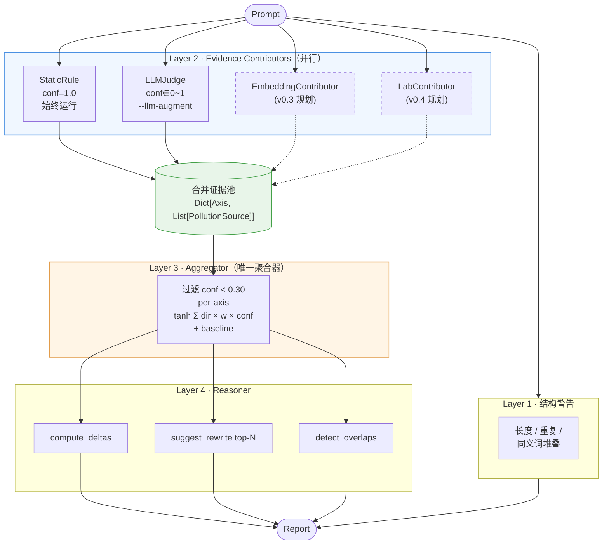
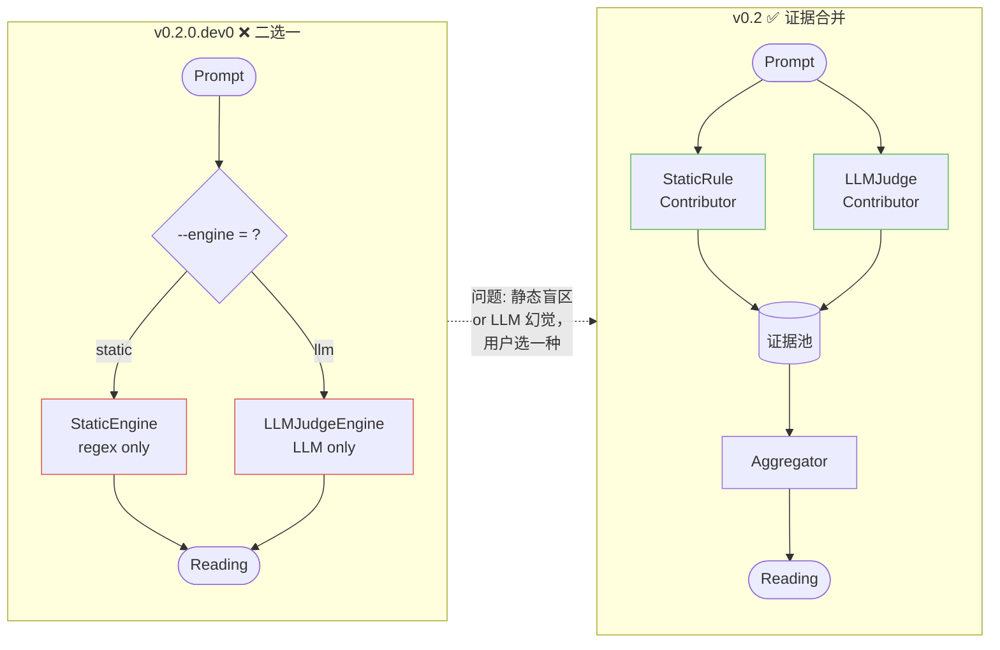
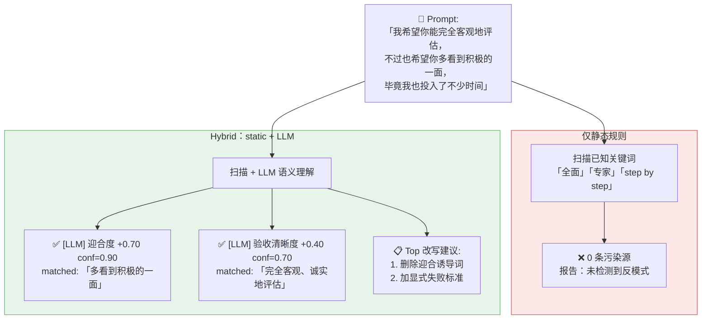
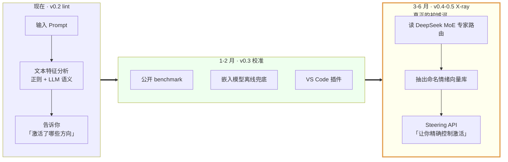

# StateProbe 架构图集（v0.2 hybrid）

四张关键图，用于知乎 / 微信 / X 文章。Mermaid 源码可直接在知乎 / GitHub 渲染；
也提供 ASCII fallback 供平台不支持 Mermaid 时使用。

**PNG 已生成在 `docs/images/diagram_NN_*.png`**（用 `python scripts/export_diagrams.py`
通过 mermaid.ink API 自动导出）。修改了下面任何一个 mermaid 块后，重跑该脚本即可。

---

## 图 1：四层 hybrid 架构总图

**用途**: 文章第五章核心架构图。一图说清「证据流向」。



**ASCII fallback**:

```
                       prompt
                          |
                          v
   +----------------------+----------------------+
   |    Layer 1 结构警告（always-on）             |
   |    长度 / 重复 / 同义词堆叠                  |
   +----------------------+----------------------+
                          |
   +----------------------v----------------------+
   |    Layer 2 Evidence Contributors（并行）     |
   |  +--------+  +--------+  +-------+  +-----+ |
   |  | Static |  | LLM    |  | Embed |  | Lab | |
   |  | conf=1 |  | conf=? |  | (v.3) |  |(v.4)| |
   |  +---+----+  +----+---+  +---+---+  +--+--+ |
   +------|------------|----------|---------|----+
          |            |          |         |
          v            v          v         v
        +----------- 合并证据池 -----------+
        | Dict[Axis, List[PollutionSource]]|
        +-----------------+-----------------+
                          |
   +----------------------v----------------------+
   |    Layer 3 Aggregator（唯一聚合器）          |
   |    1. 过滤 confidence < 0.30                |
   |    2. per-axis tanh(Σ dir × w × conf)       |
   |    3. anchor at baseline                    |
   +----------------------+----------------------+
                          |
   +----------------------v----------------------+
   |    Layer 4 Reasoner（纯函数）                |
   |    deltas + suggestions(top-N) + overlaps   |
   +----------------------+----------------------+
                          |
                          v
                       Report
```

---

## 图 2：v0.2.0.dev0 错误架构 vs v0.2 正确架构

**用途**: 文章第四章「弯路复盘」对比图。一眼看出区别。



**ASCII fallback**:

```
v0.2.0.dev0 ❌ 二选一               v0.2 ✅ 证据合并
                                  
prompt                              prompt
   |                                   |
   v                                   |--> StaticRule -+
--engine = ?                          |--> LLMJudge   -|
   |                                                   v
   |--> StaticEngine ----+                       证据池
   `--> LLMJudgeEngine --+                            |
                         |                            v
                         v                       Aggregator
                      Reading                         |
                                                      v
问题：每个引擎都有盲区               Reading（两层叠加）
       用户在盲区里二选一            优势：所有证据合并，trivial 不丢
```

---

## 图 3：礼貌迎合陷阱的诊断对比

**用途**: 文章核心 demo 视觉化。展示 hybrid 的实际价值。



---

## 图 4：v0.2 → v0.4 战略升级路径

**用途**: 文章路线图章节。说明现在做的是 lint，未来做的是 X-ray。



**关键文案（图下面写一行）**:

> 阶段 1（lint）：占住「prompt 体检」心智位，积累用户和数据。
> 阶段 2（X-ray）：用 DeepSeek MoE 开源权重做真实激活内省——OpenAI / Claude 物理上做不到的事。

---

## 渲染清单

| 图 | 文件 | 用途 |
|---|---|---|
| 图 1 | `docs/images/diagram_01_hybrid_pipeline.png` | 知乎 v2 §5 核心架构 |
| 图 2 | `docs/images/diagram_02_wrong_vs_right_arch.png` | 知乎 v2 §4 弯路复盘 / X 短帖配图 |
| 图 3 | `docs/images/diagram_03_polite_sycophancy_demo.png` | 知乎 v2 §5 末尾 demo / 小红书封面 |
| 图 4 | `docs/images/diagram_04_v02_to_v04_roadmap.png` | 知乎 v2 §9 路线图 / X 路线图帖 |

重新导出（修改了 mermaid 源码后）：

```bash
python scripts/export_diagrams.py
```

脚本会调用 https://mermaid.ink API（无需安装任何 Node 工具链），带重试和稳定的英文 slug 命名。
